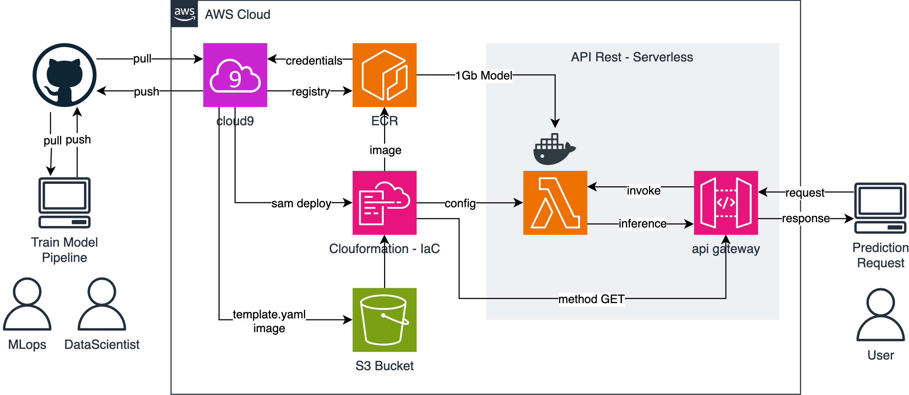
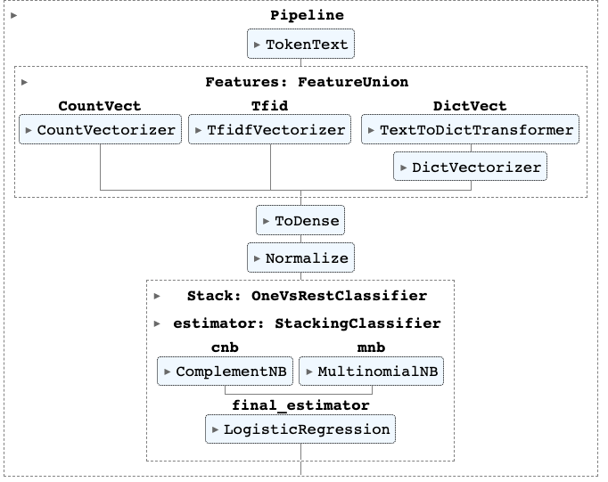
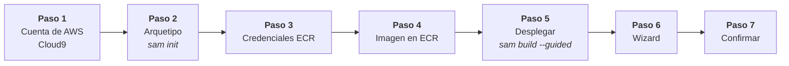
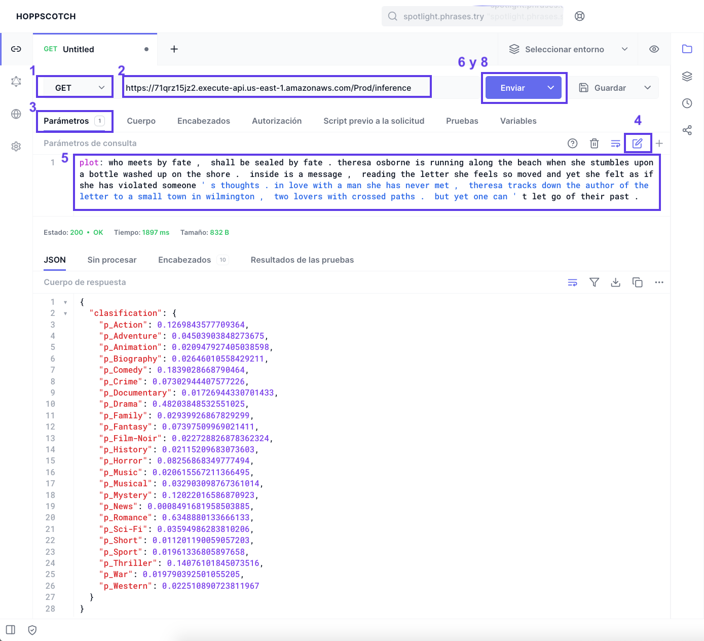
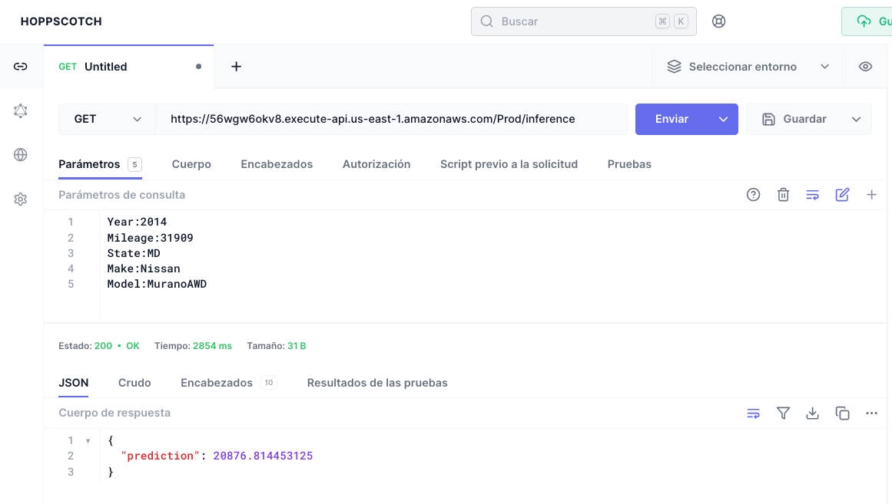
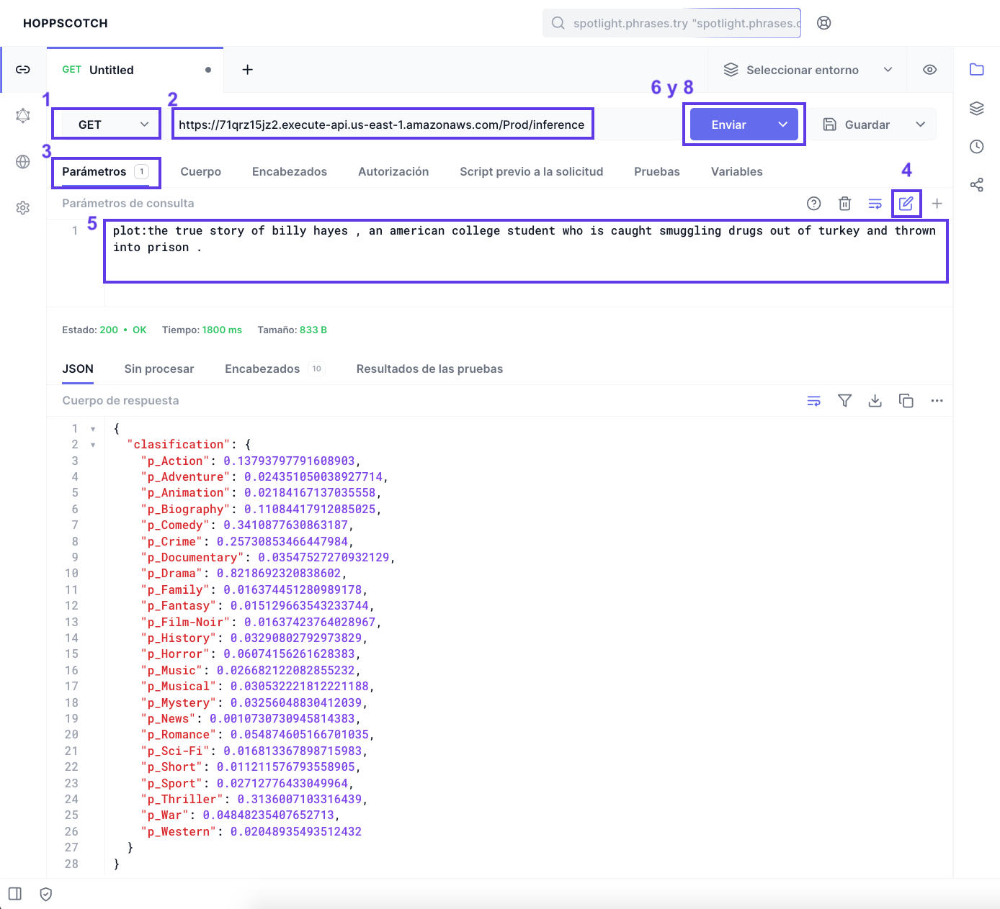
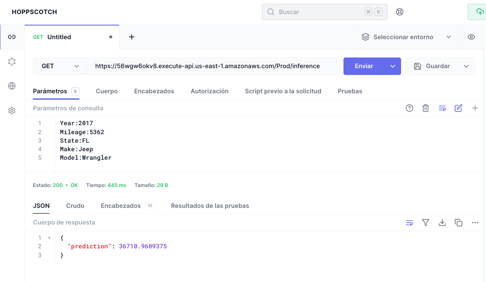

[](https://aws.amazon.com/es/)
[](https://peps.python.org/pep-0596/#schedule-first-bugfix-release)
[](https://github.com/scikit-learn/scikit-learn)
[](https://hub.docker.com/r/amazon/aws-lambda-python)
[](gender_movie_classification/events/event.json)
[](https://hoppscotch.io/)


# GenderMovieClassification

## Infraestructura - IaC
El respositorio actual permite desplegar la siguiente arquitectura para disponibilizar un modelo que clasifica genero de peliculas, previamente calibrado utilizando solo la bilbioteca de sklearn.



## Modelo Predictivo

El pipeline que se [serializó](./gender_movie_classification/model_inference/model/) fue el que se muestra a continuación

<div style="text-align:center"></div>


## Desplegando el Servicio

Se efectuan los siguientes pasos:



1. Al ingresar a AWS se levanta el servicio cloud9, con una instancia EC2 de por lo menos t3.medium y se clona este respositorio
   ```bash
   $ git clone https://github.com/HubertRonald/GenderMovieClassification.git
   ```
2. Ingresar al directorio donde está el arquetipo y ejecutar el compilar el servicio con `sam`, más informacio [aquí](./gender_movie_classification/README.md)
   ```bash 
   $ cd GenderMovieClassification/gender_movie_classification
   $ sam init
   ```
3. Como se requiere levantar el servicio ECR, para ello es necesario saber cuál es nuestro **accountID** (`$ aws configure list`) y la **region** que se emplea habitualmente para la cuenta antes encontrada (`$ aws sts get-caller-identity --query Account --output text`)
    ```bash
    $ aws --region <region> ecr get-login-password | docker login \
        --username AWS \
        --password-stdin <accountID>.dkr.ecr.<region>.amazonaws.com
    ```
4. Crear el respositorio de la imagen con el nombre de `gender-movie-classification`
    ```bash
    $ aws ecr create-repository \
      --repository-name "gender-movie-classification" \
      --image-tag-mutability MUTABLE \
      --image-scanning-configuration scanOnPush=true
    ```

    > Se obtiene el **"repositoryUri"**:
`<region>.dkr.ecr.us-east-1.amazonaws.com/gender-movie-classification`

5. Se despliega con `sam`, más informacio [aquí](./gender_movie_classification/README.md)
  ```bash
  $ sam deploy --guided
  ```
6. Diligenciar el wizard
    ```bash
    Configuring SAM deploy
    ======================

          Looking for config file [samconfig.toml] :  Found
          Reading default arguments  :  Success

          Setting default arguments for 'sam deploy'
          =========================================
          Stack Name [GenderMovieClassification]: GenderMovieClassification
          AWS Region [us-east-1]: us-east-1
          #Shows you resources changes to be deployed and require a 'Y' to initiate deploy
          Confirm changes before deploy [Y/n]: Y
          #SAM needs permission to be able to create roles to connect to the resources in your template
          Allow SAM CLI IAM role creation [Y/n]: Y
          #Preserves the state of previously provisioned resources when an operation fails
          Disable rollback [y/N]: N
          ModelInferenceFunction has no authentication. Is this okay? [y/N]: y
          Save arguments to configuration file [Y/n]: n

          Looking for resources needed for deployment:
          Creating the required resources...
    ```

7. Confirmar despliegue de plantilla compilada en clouformation.


## Consumiendo API

Para obtener (método **GET**) la clasificación(es) del genero de una película a partir del modelo previamente industrializado, se tienen las siguientes opciones:

1. En una terminal con alguna distribución Linux, Unix (macOS) o PowerShell de Windows (También puede emularse un [WSL](https://learn.microsoft.com/en-us/windows/wsl/install) en Windows)
   
    **Ejemplo 1 - E1**
    ```bash
    curl -G \
      -d "plot=who meets by fate ,  shall be sealed by fate . theresa osborne is running along the beach when she stumbles upon a bottle washed up on the shore .  inside is a message ,  reading the letter she feels so moved and yet she felt as if she has violated someone ' s thoughts . in love with a man she has never met ,  theresa tracks down the author of the letter to a small town in wilmington ,  two lovers with crossed paths .  but yet one can ' t let go of their past ." \
      "https://56wgw6okv8.execute-api.us-east-1.amazonaws.com/Prod/inference"
    ```

    **Ejemplo 2 - E2**
    ```bash
    curl -G \
      -d "plot=the true story of billy hayes ,  an american college student who is caught smuggling drugs out of turkey and thrown into prison ." \
      "https://56wgw6okv8.execute-api.us-east-1.amazonaws.com/Prod/inference"
    ```

2. Empleando [hoppscotch](https://hoppscotch.io/) (servicio similar a **postman** pero online)

    **Ejemplo 1 - E1**

    *Formulario E1*
    

    ---
    *Respuesta E1*
    


    **Ejemplo 2 - E2**

    *Formulario E2*
    
    
    ---
    *Respuesta E2*
    

    Para la carga masiva mostradas en las imagenes de arriba
    |Ejemplo 1 - E1 | Ejemplo 2 - E2 |
    |---|---|
    |plot:who meets by fate ,  shall be sealed by fate .  theresa osborne is running along the beach when she stumbles upon a bottle washed up on the shore .  inside is a message ,  reading the letter she feels so moved and yet she felt as if she has violated someone ' s thoughts .  in love with a man she has never met ,  theresa tracks down the author of the letter to a small town in wilmington ,  two lovers with crossed paths .  but yet one can ' t let go of their past .|plot:the true story of billy hayes ,  an american college student who is caught smuggling drugs out of turkey and thrown into prison .|

    Endpoint método **GET**
    ```bash
    https://56wgw6okv8.execute-api.us-east-1.amazonaws.com/Prod/inference
    ```


> **Nota:** Para los ejemplos 1 y 2, se obtienen las respuestas:

 |Ejemplo 1 - E1 | Ejemplo 2 - E2 |
|----|----|
| {'p_Action': 0.1269843577709364, 'p_Adventure': 0.04503903848273675, 'p_Animation': 0.020947927405038598, 'p_Biography': 0.02646010558429211, 'p_Comedy': 0.1839028668790464, 'p_Crime': 0.07302944407577226, 'p_Documentary': 0.01726944330701433, 'p_Drama': 0.48203848532551025, 'p_Family': 0.02939926867829299, 'p_Fantasy': 0.07397509969021411, 'p_Film-Noir': 0.022728826878362324, 'p_History': 0.02115209683073603, 'p_Horror': 0.08256868349777494, 'p_Music': 0.020615567211366495, 'p_Musical': 0.032903098767361014, 'p_Mystery': 0.12022016586870923, 'p_News': 0.0008491681958503885, 'p_Romance': 0.6348880133666133, 'p_Sci-Fi': 0.03594986283810206, 'p_Short': 0.011201190059057203, 'p_Sport': 0.01961336805897658, 'p_Thriller': 0.14076101845073516, 'p_War': 0.019790392501055205, 'p_Western': 0.022510890723811967} | {'p_Action': 0.13793797791608903, 'p_Adventure': 0.024351050038927714, 'p_Animation': 0.02184167137035558, 'p_Biography': 0.11084417912085025, 'p_Comedy': 0.3410877630863187, 'p_Crime': 0.25730853466447984, 'p_Documentary': 0.03547527270932129, 'p_Drama': 0.8218692320838602, 'p_Family': 0.016374451280989178, 'p_Fantasy': 0.015129663543233744, 'p_Film-Noir': 0.01637423764028967, 'p_History': 0.03290802792973829, 'p_Horror': 0.06074156261628383, 'p_Music': 0.026682122082855232, 'p_Musical': 0.030532221812221188, 'p_Mystery': 0.03256048830412039, 'p_News': 0.0010730730945814383, 'p_Romance': 0.054874605166701035, 'p_Sci-Fi': 0.016813367898715983, 'p_Short': 0.011211576793558905, 'p_Sport': 0.02712776433049964, 'p_Thriller': 0.3136007103316439, 'p_War': 0.04848235407652713, 'p_Western': 0.02048935493512432} |


## Eliminar Recursos

1. Eliminar imagen de docker en el ECR
  ```bash
  aws ecr delete-repository --registry-id <account-id> --repository-name gender-movie-classification --force
  ```

2. Eliminar stack desde `sam`, más informacio [aquí](./gender_movie_classification/README.md)
```bash
sam delete --stack-name "GenderMovieClassification"
```

3. Finalmente en `S3` eliminar aquel bucket creado por `sam` cuyo nombre contenga `GenderMovieClassification`, hacer lo propio en `cloudformation`

## Fuentes

Documentación consultada y complementaria

1. [Deploying machine learning models with serverless templates](https://aws.amazon.com/es/blogs/compute/deploying-machine-learning-models-with-serverless-templates/)
2. [Serverless Rest API on AWS with Lambda and API Gateway using SAM (Serverless Application Model)](https://apoorv487.medium.com/serverless-rest-api-on-aws-with-lambda-and-api-gateway-using-sam-serverless-application-model-4aa3b550be1d)
3. [AWS Lambda Now Supports Up to 10 GB Ephemeral Storage](https://aws.amazon.com/es/blogs/aws/aws-lambda-now-supports-up-to-10-gb-ephemeral-storage/)

Para modelos predictivos más pequeños (sin docker)

4. [Deploying a Machine Learning Model to a Serverless Backend with SAM CLI](https://medium.com/carnegie-mellon-robotics-academy/going-serverless-for-your-ml-backend-with-sam-cli-5332912019ef)